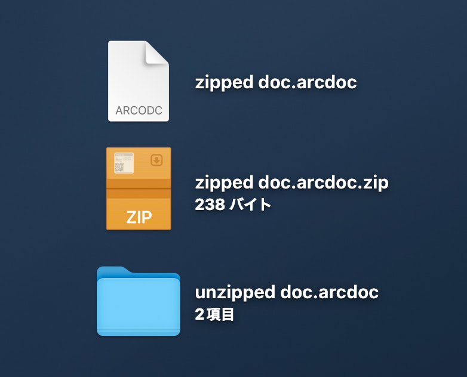

# ZipArchivedDocument
The sample implementation of zip-archived document for a macOS AppKit platform. You can implement NSDocument-based I/O of archived document in your application like `.sketch` or `.key`.

The `.arcdoc` document file defined in this sample is zip archived and can be unzipped on the Finder by adding `.zip` to the extension.

[ZIP Foundation](https://github.com/weichsel/ZIPFoundation) framework is used for the zip archiving process.

See the NSDocument implementation for details.
